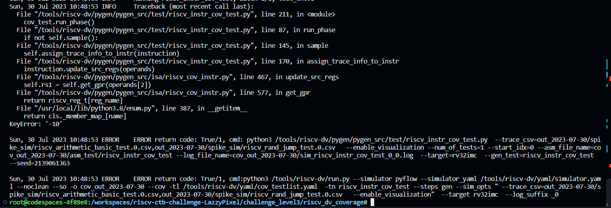
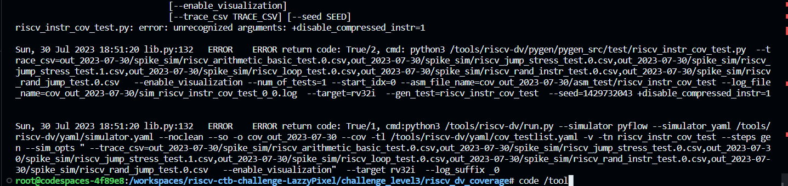

# riscv_ctb_challenges
# Challenge_level3

For Challenge 3 Capture The Bug i have found 2 bugs in the buggy design.
To find out bugs i have followed few things
- To find the bugs I have used both Directed as well as Random tests.
- To make things easier i have created two scripts
    - dump_conv.py
        - converts RTL SPIKE or difference dump files into readable format
        - It take one input_file arguement and produce an output of readable_input_file
        - Name of output file is optional
    -  sig_match.py
         - It compares signature files of RTL and SPIKE dump.
         - It can take zero, one, two input_file arguement and produces result as PASS or FAIL.
         - for simplification, In case of zero argument it takes default signature files produced in this project.
## Captured Bugs
- ### Bug 1: 
    - OR instruction 
        - To reproduce the BUG or.S is present inside directed test directory.
        - Before running make, Open Makefile and replace test.S with or.S in the compile target section.
        - in the result of make is clearly visible that results of RTL and SPIKE are different.
        - for more analysis we can use spike.dump and rtl.dump with dump_conv.py
- ### Bug 2: 
    - ORI instruction
        - To reproduce the BUG ori.S is present inside directed test directory.
        - Before running make, Open Makefile and replace test.S with ori.S in the compile target section.
        - in the result of make is clearly visible that results of RTL and SPIKE are different.
        - for more analysis we can use spike.dump and rtl.dump with dump_conv.py
     
# Challenge_level3 Coverage
- ### Bug1
    This issue while running cov command for riscv_arithmetic_basic_test.
    

    #### Log:
        2023-07-30 10:49:48,407 riscv_instr_cov_test.py 77 INFO operand = s9,t2,-10
        2023-07-30 10:49:48,407 riscv_instr_pkg.py 1370 INFO imm: 80000124 -> 2147483940
        2023-07-30 10:49:48,407 riscv_instr_pkg.py 1370 INFO imm: ff93ab23 -> 4287867683
        2023-07-30 10:49:48,407 riscv_cov_instr.py 576 ERROR Cannot convert -10 to GPR

My issue is fixed by modifying https://github.com/chipsalliance/riscv-dv/blob/648900d581fba7c1274dc35d8ee7db07404aaec9/pygen/pygen_src/isa/riscv_cov_instr.py#L467-L469

I believe it should be

                self.rs1 = self.get_gpr(operands[1])
                self.rs1_value.set_val(self.get_gpr_state(operands[1]))
                self.imm.set_val(get_val(operands[2]))

- ### Bug2
    issue while adding --target rv32i
    
    
    To fix this issue is replaced `+disable_compressed_instr=1`  with `--disable_compressed_instr=1` 
    https://github.com/chipsalliance/riscv-dv/blob/648900d581fba7c1274dc35d8ee7db07404aaec9/run.py#L336
