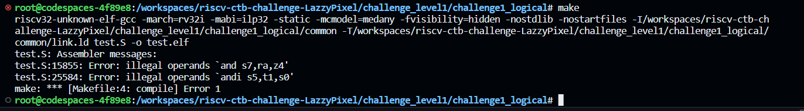

# Challenge1_logical 

The test.S had two syntex issue following at line 15855, 25584.

   
## Syntex issue 1: 
Line 15855 contains the "add" instruction: `and s7, ra, z4`. Upon careful examination, it becomes evident that the third operand, `z4` is invalid. 
### Solution: 
- To address this problem, I replaced `z4` with `a4`.
- Now the replaced instruction at line 15855 is  `and s7, ra, a4`.

## Syntex issue 2: 
Line 25584 contains the instruction: `andi s5, t1, s0`. Upon careful observation, it becomes apparent that the second operand is a register, which is not allowed for an I-type (immediate) instruction.
### Solution: 
To address this problem, We have two potential solutions :
- Replace `andi` with an appropriate R-type instruction.
- Replace the second argument with an immediate value (a 12-bit value).
To resolve this issue, I opted for the first approach, where I replaced the andi with and instruction.

- Now the replaced instruction at line 25584 is  `and s5, t1, s0`.