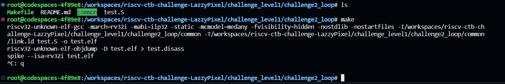
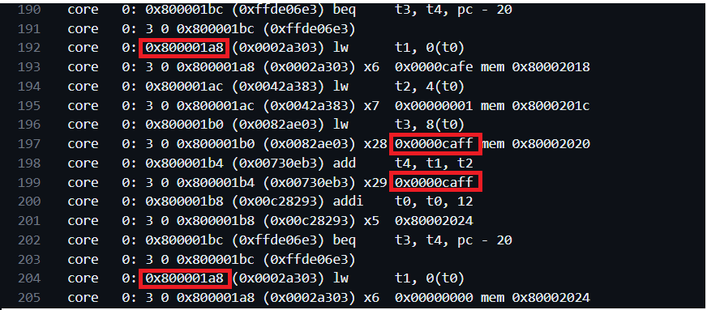
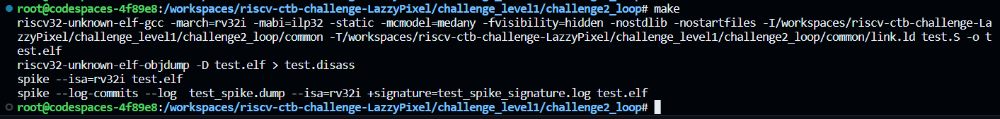
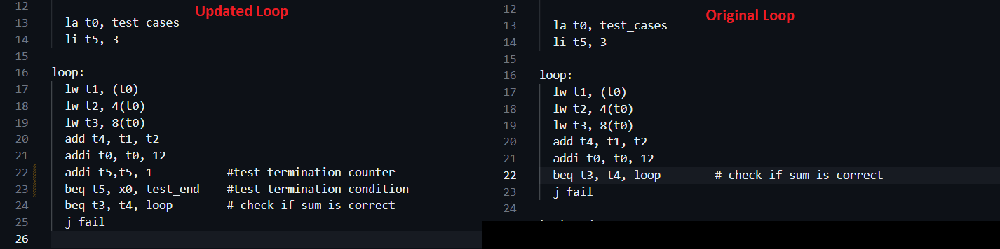

# Challenge2_loop 

After running make, First the compilation was stuck and after Observing the spike dump it was clear it is stuck in an infinite loop.

## Observations 
- test dump was not generated to from, so used below command from Makefile.
   - `spike -l --log-commits --log  test_spike.dump --isa=rv32i +signature=test_spike_signature.log test.elf`
- test.S is aiming for self checking additon for three times.
- Here `beq t3, t4, loop` is main loop to run iterations.
- There is no termination Condition that can terminate main loop after 3ed iterations. that why infinite loop situtation.
- 
  
## Solution
To control the loop termination, two elements are required:
1. Iteration Counter:
   - The iteration counter is already present at line 14 as `li t5, 3`.
2. Termination Condition:
   - To introduce the termination condition, I included two additional instructions just before the loop at line 22 as follows:
   
         addi t5, t5, -1         # Decrease the counter with each iteration
         beq t5, x0, test_end   # Check if the counter/iterator is equal to 0 for proceed to the test_end.
These adjustments were made to ensure proper termination control in the program.

#### Original vs Updated Test :-
